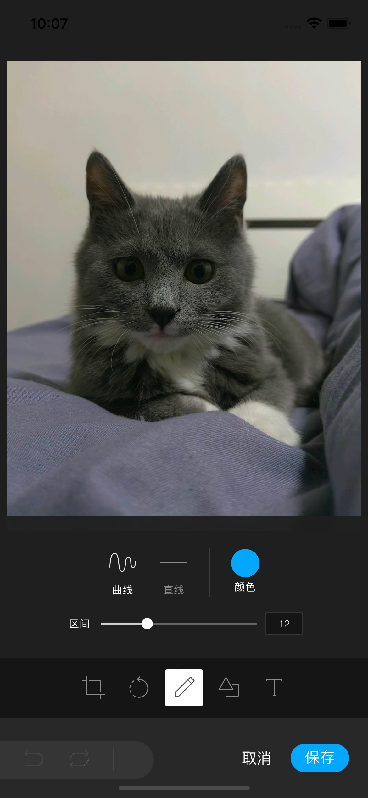

# uni-image-editor

用 fabric+tui-image-editor 实现的 h5 版的图片编辑器，嵌入 uniapp 中可以直接使用，也可以改造一下用于其他 h5 场景

## uniapp 场景

调用`msgFromUniapp`方法传入 base64，保存了之后通过`uni.postMessage`回传 base64，可以通过 [image-tools](https://ext.dcloud.net.cn/plugin?id=123#detail) 插件进行 base64 和图片互转

## 普通 h5 场景

改造一下初始化和保存方法，就可使用，原理同上

## 效果如下

